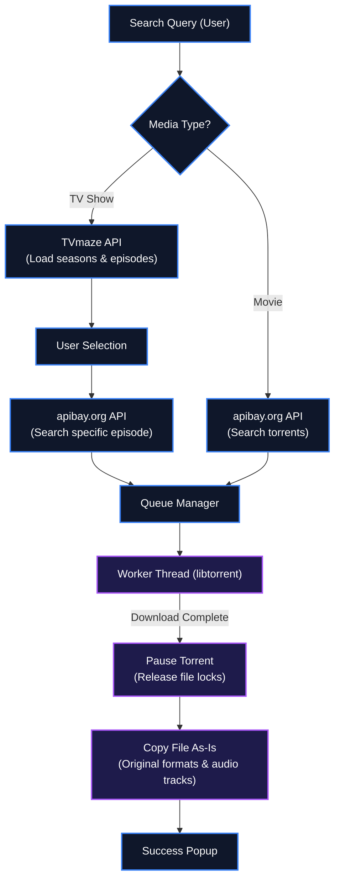

# 📺 Movies & TV Shows Downloader for iPad

[](https://www.python.org/)
[](https://github.com/TomSchimansky/CustomTkinter)
[](https://libtorrent.org/)
[](https://opensource.org/licenses/MIT)

A Python desktop application with a modern, dark-themed GUI (built using `customtkinter`) that allows users to search for movies and TV shows, manage a download queue, download content programmatically using a native BitTorrent library (`libtorrent`), and save files directly as-is in their original extensions, perfectly named and organized for local playback on iPad (best played using VLC).

---

## 📖 Table of Contents
- [Direct Download](#-direct-download)
- [What This Project Does](#-what-this-project-does)
- [System Architecture & Flow](#-system-architecture--flow)
- [Key Features](#-key-features)
- [Technical Stack](#-technical-stack)
- [Installation & Setup](#-installation--setup)
- [How to Run](#-how-to-run)
- [Packaging & Distribution](#-packaging--distribution)
- [Transferring and Watching on iPad](#-transferring-and-watching-on-ipad)
- [File Structure](#-file-structure)
- [License](#-license)

---

## 🚀 Direct Download

You can download the compiled standalone Windows installer directly here:
👉 **[Download MoviesAndShowsInstaller.exe (24.4 MB)](https://github.com/IamOumarIbrahim/movies-shows-downloader/raw/master/MoviesAndShowsInstaller.exe)**

---

## 💡 What This Project Does

Watching movies and TV shows on an iPad typically requires paid streaming subscriptions or complex transcoding steps to convert files to compatible formats. 

This project provides a **completely free, automated desktop client** that:
- Searches TV show metadata and finds high-quality torrent matches dynamically.
- Prioritizes iPad-compatible video profiles (H.264 video, MP4 container) over HEVC/x265 to avoid "black screen, audio only" issues.
- Downloads files in the background using an optimized `libtorrent` wrapper.
- Automatically saves files directly in a clean, organized folder structure on your PC, ready to be transferred to your iPad Files or VLC.

---

## ⚙️ System Architecture & Flow

The downloader interface searches public APIs and matches query inputs against a local BitTorrent download queue.



---

## ⭐ Key Features

- **📺 TV Show Metadata (TVmaze API)**: Instantly search and browse TV shows, view show details, cover poster art, and dynamically load all seasons and episode lists.
- **🔍 Strict Title Validation**: Implements a word-boundary title matcher ensuring that search queries map to the correct show name (preventing incorrect matches, such as *Your Friends and Neighbors* when searching for *Friends*).
- **⚡ 720p/480p & H.264 Prioritization**: Torrent search algorithm ranks and selects the healthiest 720p or 480p torrents. It actively penalizes HEVC/x265, AV1, and 10-bit color formats while promoting highly compatible H.264 (x264) video tracks and `.mp4` containers, ensuring video plays natively in your iPad Files app.
- **🚀 High-Speed Peer Discovery**: Configures the `libtorrent` session to enable UPnP, NAT-PMP, DHT, and Local Service Discovery (LSD), letting the application bypass NAT firewalls and connect to much larger sets of local and global peers for optimized download throughput.
- **🔄 Self-Healing Auto-Retries**: If a torrent fails to download or has no active seeders (metadata fetching timeout), the downloader automatically cycles through alternative search results (ranks 2-5) and retries the download sequentially.
- **🔒 Safe File Copying (No Locks)**: Automatically pauses active torrent downloads before copying files. This flushes write caches and releases Windows file handle locks, preventing file sharing violations or incomplete files.
- **📁 Queue Sidebar**: Real-time left sidebar tracking queued and actively downloading items with progress status and individual file percentages.
- **💾 Direct Saving (No ZIP)**: Downloads save directly as-is to your selected directory (organized in folders like `Downloads/Friends - Season 01/`).
- **🔊 As-Is Quality Preservation**: Bypasses transcoding completely, saving video files exactly as they are seeded. This preserves 100% of the original video and multi-channel audio tracks (AC3/DTS/AAC) without silent audio errors.

---

## 🛠️ Technical Stack

| Dependency | Purpose | Details |
| :--- | :--- | :--- |
| **Python** | Language Core | Version 3.12+ |
| **CustomTkinter** | UI Engine | Dark-themed, responsive widgets |
| **libtorrent** | Torrent Client | Python bindings for rasterbar libtorrent |
| **Pillow (PIL)** | Poster Rendering | Handles media covers in GUI |
| **TVmaze API** | TV Metadata | Open REST API for seasons/episodes indexing |
| **apibay.org API** | Torrent Indexing | Pirate Bay backend crawler index |

---

## 🚀 Installation & Setup

1. **Clone the Repository**:
   ```bash
   git clone https://github.com/IamOumarIbrahim/movies-shows-downloader.git
   cd movies-shows-downloader
   ```

2. **Install Dependencies**:
   ```bash
   pip install customtkinter requests beautifulsoup4 pillow pyinstaller
   pip install libtorrent
   ```

3. **Verify Installation**:
   Ensure python can import `libtorrent` and `customtkinter`:
   ```bash
   python -c "import libtorrent as lt; import customtkinter; print(lt.__version__)"
   ```

---

## 🏃 How to Run

### Option A: Graphical Interface (GUI)
Launch the dark-themed desktop GUI:
```bash
python app.py
```

### Option B: Interactive CLI
Launch the interactive terminal-based media downloader:
```bash
python downloadcc.py "Vampire Diaries"
```
* **Controls**: Use the **Up/Down arrow keys** to navigate, **Enter** to select, and **Esc** to cancel.
* **Auto-naming**: Automatically structures downloaded content to `S_XX_E_YY.mp4` for iPad playback.

---

## 📦 Packaging & Distribution

### 1. Compile Standalone Executable (PyInstaller)
To compile the Python scripts into a single standalone Windows executable containing all dependencies:
```bash
pyinstaller --noconfirm MoviesAndShowsDownloader.spec
```
This will generate the compiled files inside `dist/MoviesAndShowsDownloader/`.

### 2. Compile Windows Installer (Inno Setup)
An Inno Setup compilation script `installer.iss` is included in the project directory. Run it using the Inno Setup compiler (`ISCC.exe`):
```bash
& "C:\Users\omarb\AppData\Local\Programs\Inno Setup 6\ISCC.exe" installer.iss
```
This compiles the files into a single Windows Setup program `MoviesAndShowsInstaller.exe`.

---

## 📱 Transferring and Watching on iPad

Since files are downloaded as-is:
1. **Transfer to iPad**:
   - **Cloud Sync**: Put the downloaded season folders directly into your iCloud Drive, OneDrive, or Google Drive folder on your PC. They will sync and appear in your iPad's **Files** app.
   - **Local Transfer**: Connect your iPad via USB, open the Apple Devices app or iTunes, go to **File Sharing**, and drag the folders directly into the **VLC** app.
2. **Watch with Audio**:
   - Open **VLC on iPad** (completely free on the App Store).
   - Navigate to the synced files. VLC natively supports all video formats (MKV, MP4, AVI) and all audio decoders (AC3/DTS/AAC), ensuring high-fidelity sound and smooth video playback on your iPad screen!

---

## 📁 File Structure

```
MoviesAndShowsInstaller/
├── .gitignore                   - Git ignore patterns
├── README.md                    - Project documentation (this file)
├── MoviesAndShowsInstaller.exe  - Compiled standalone Windows installer
├── MoviesAndShowsDownloader.spec- PyInstaller spec file
├── app.py                       - Main application entry point (dark GUI)
├── downloader.py                - Queue manager & libtorrent background worker
├── installer.iss                - Inno Setup compiler configuration
└── search_engine.py             - TVmaze metadata and Pirate Bay torrent indexes interface
```

---

## 📄 License
This repository is licensed under the [MIT License](LICENSE).
